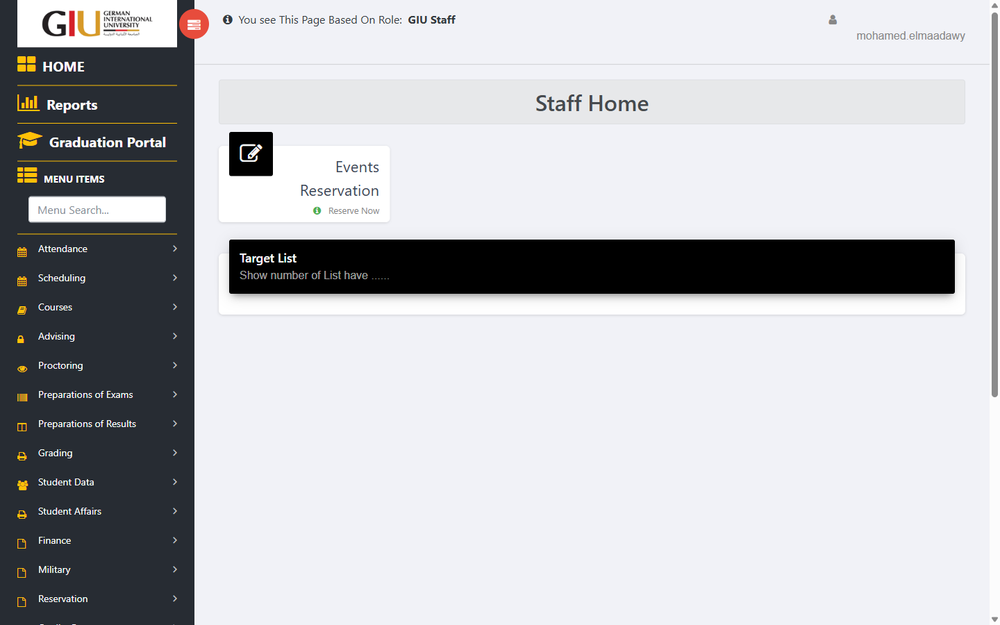
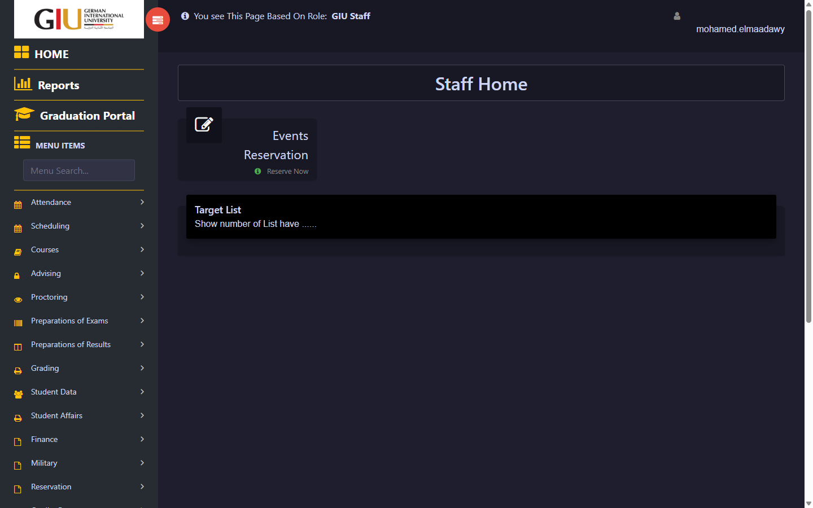
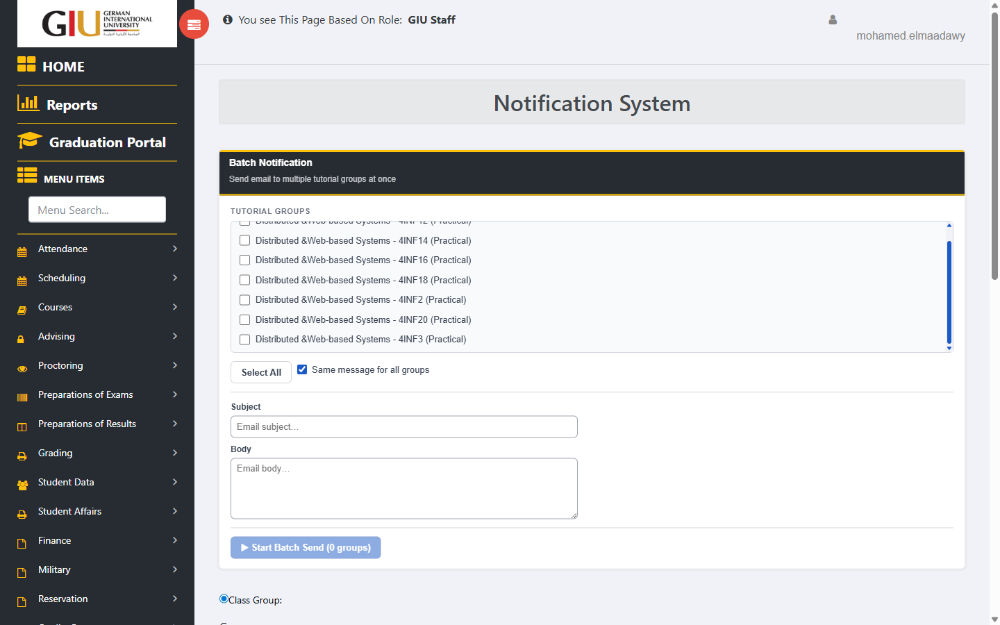
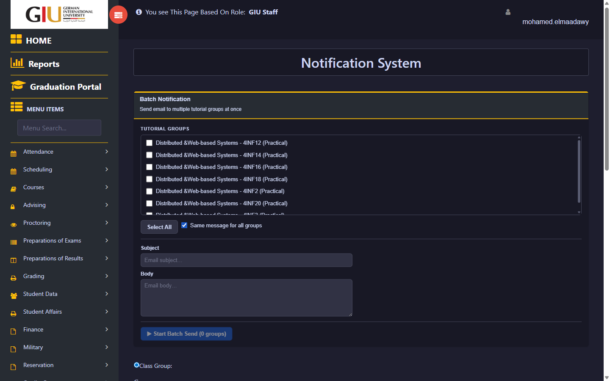
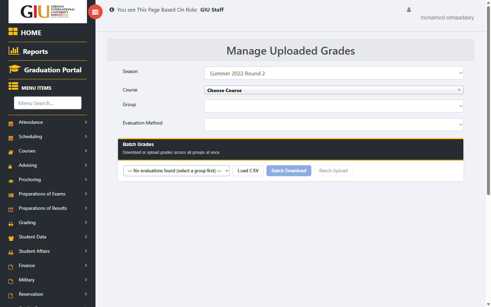
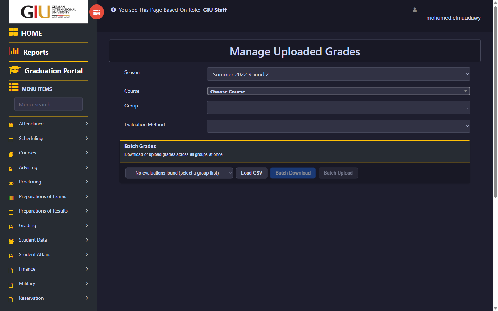
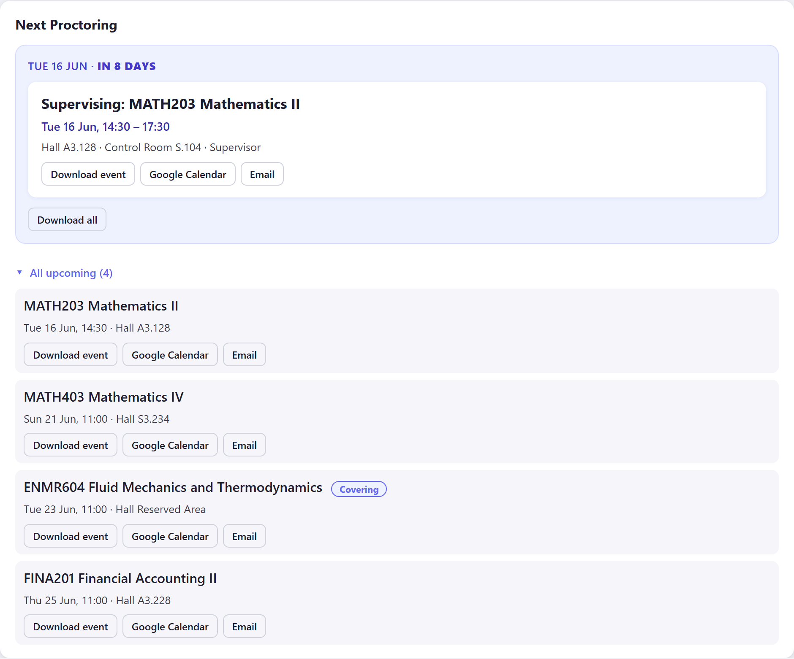
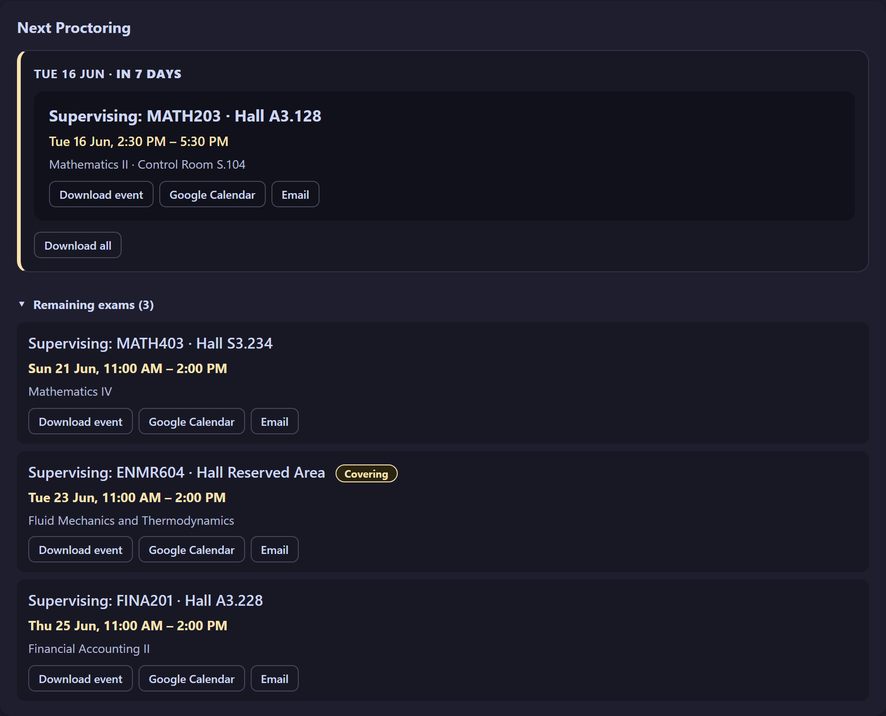

# GIU SuperScript

A collection of Tampermonkey userscripts that enhance the GIU staff portal at [portal.giu-uni.de](https://portal.giu-uni.de). Each script injects UI directly into the portal page and feels native to the original design.

---

## Suggestions & Feedback

For suggestions, bug reports, or feature requests, send an email to [mohamed.elmaadawy@giu-uni.de](mailto:mohamed.elmaadawy@giu-uni.de).

---

## Installation

### Step 1 — Install Tampermonkey

| Browser | Link |
|---|---|
| Chrome / Edge / Brave | [Tampermonkey on Chrome Web Store](https://chromewebstore.google.com/detail/tampermonkey/dhdgffkkebhmkfjojejmpbldmpobfkfo) |
| Firefox | [Tampermonkey on Firefox Add-ons](https://addons.mozilla.org/en-US/firefox/addon/tampermonkey/) |
| Safari | [Tampermonkey on App Store](https://apps.apple.com/us/app/tampermonkey/id1482490089) |

### Step 2 — Install a Script

**Option A — Paste the script manually:**

1. Open Tampermonkey → click the extension icon → **Dashboard**
2. Click **+** (Create a new script)
3. Delete the placeholder code
4. Open the `.js` file from this repo, copy all contents, paste into the editor
5. Press **Ctrl + S** (or **File → Save**) — the script is now active

**Option B — Install from file:**

1. Open Tampermonkey → **Dashboard** → **Utilities** tab
2. Under **Import**, click **Choose File** and select the `.js` file
3. Click **Install** on the confirmation page

### Step 3 — Verify

After saving, go to the target page listed for each script below. A new panel or toolbar should appear automatically. No page refresh needed if you were already on the page — navigate away and back once.

---

## Scripts

### 1. GIU Dark Mode

**File:** `GIU Dark Mode.js` | **Version:** 2.7 | **Author:** Mo.Elmaadawy

A portal-wide dark mode toggle using the Catppuccin Mocha palette. Applies clean, layered dark colors to every portal page — including all co-scripts — without inverting images or breaking portal styling.

**Target page:**
```
https://portal.giu-uni.de/*
```

**Features:**

- **One-click toggle** — fixed yellow tab on the right edge of every portal page
- **Persists across pages** — preference saved in `localStorage`, applies before first paint (no flash)
- **Catppuccin Mocha palette** — page `#1e1e2e`, cards `#181825`, headers `#11111b`, inputs `#313244`
- **Depth hierarchy** — cards darker than the page background for natural layering
- **No visible borders** — transparent borders throughout; depth communicated through shade, not outlines
- **Full co-script coverage** — correctly styles all other GIU SuperScript panels and components

| Light | Dark |
|---|---|
|  |  |

| Light | Dark |
|---|---|
|  |  |

| Light | Dark |
|---|---|
|  |  |

---

### 2. GIU Staff Enhanced Attendance

**File:** `GIU Staff Attendance Script.js` | **Version:** 3.0.7 | **Author:** Mo.Elmaadawy

A full attendance management dashboard injected above the Swift Report attendance table. Tracks your hours, leave balance, and exceptions — all stored locally in your browser.

**Target page:**
```
https://portal.giu-uni.de/GIUb/EXT/SwiftReports_m.aspx?swiftreportid=866&executereport=1
```

**Features:**

- **Payroll period tracking** — groups rows into monthly periods (11th → 10th of next month)
- **Balance summary** — actual vs. required hours, progress bar, extra/missing balance
- **Present / Absent / Late tracking** — late threshold: 10:30 AM normal, 9:30 AM Ramadan
- **Holiday & Annual Leave** — add single dates or ranges, bulk remove, deduplication
- **Annual leave balance** — editable remaining days (supports decimals), auto-accrues +2 days per payroll month
- **Attendance overrides** — custom hours for mission days, IN/OUT anomalies, etc.
- **Compensation days** — earn by working your day off (capped 1/week), use within same period
- **Ramadan mode** — reduced required hours (6h), adjusted thresholds
- **Exam period** — configurable last-out time cap override
- **Conflict detector** — flags dates marked as both holiday and override/compensation
- **Audit log** — per-day status and reason (Present, Absent, Holiday, Day Off, etc.)
- **Import / Export** — full settings backup and restore as JSON
- **Onboarding guide** — first-time spotlight walkthrough for all features
- **Auto record pruning** — cleans records older than 2 payroll months


**Usage:**

1. Navigate to the Swift Report page (link above)
2. The attendance dashboard appears above the report table
3. On first visit, a guided walkthrough launches automatically
4. Set your **Day Off** in Settings — applies from a chosen start date forward
5. Add holidays, overrides, and compensation days as needed
6. Use **Export Settings** to back up your configuration before clearing browser data

---

### 3. GIU Notification Batch Send

**File:** `GIU Notification Batch Send.js` | **Version:** 1.3 | **Author:** Mo.Elmaadawy

Sends the same email notification to multiple tutorial groups in sequence. Write subject and body once — the script steps through each selected group using a localStorage queue and page reloads.

**Target page:**
```
https://portal.giu-uni.de/GIUb/INTStaff/NotificationSystem_SendEmail_m.aspx
```

**Features:**

- **Batch send** — select all groups or a specific subset, then send to all in one click
- **Course filter** — filter the group list by course name or code (e.g. "Distributed & Web-based Systems") when you teach multiple courses
- **Course name display** — groups show full course name instead of raw codes (e.g. `Distributed & Web-based Systems - 4INF2 (Practical)`)
- **Select All** — respects the active course filter, only selects visible groups
- **Progress tracking** — live banner updates after each group is processed
- **Summary table** — shows sent / failed status per group when the batch completes


**Usage:**

1. Navigate to the Send Email page (link above)
2. The batch panel loads above the standard email form
3. *(Optional)* Use the course filter dropdown to narrow the group list to one course
4. Select the groups you want to notify (or click **Select All**)
5. Write your subject and body in the fields provided
6. Click **Send to Selected Groups** — the script sends group by group and reports results

> **Note:** The script uses page reloads to submit each group's form. Keep the tab open until the batch completes.

---

### 4. GIU Upload Grades

**File:** `GIU Upload Grades.js` | **Version:** 2.3 | **Authors:** Ahmed Sherif, Mo.Elmaadawy

Batch grade download and upload across all student groups on the Manage Uploaded Grades page. Runs entirely in the background via fetch — no page reloads between groups.

**Target page:**
```
https://portal.giu-uni.de/GIUb/EXT/ManageUploadedGrades_m.aspx
```

**The script works in two states depending on where you are on the page:**

**State A — Dropdowns visible (before grade table):**

A toolbar is injected with a custom evaluation method picker. Selecting from it keeps you on the same page.

- **Batch Download** — iterates every group, downloads one combined CSV (Name, Group, Grade)
- **Batch Upload** — load a CSV file, then push grades to every group automatically
- **Grade statistics** per group — Min, Max, Average, Range, Pass Rate displayed after each operation

**State B — Grade table visible (after selecting group + eval):**

- **Upload CSV** — fills current group's grade inputs from a CSV file
- **Download CSV** — exports current group's grades as a CSV file

**CSV format:**
```csv
Name,Group,Grade
(12345678) Ahmed Mohamed,INCS 406 - 4INF2 (Practical),85
(87654321) Sara Ali,INCS 406 - 4INF2 (Practical),90
```

Grades are matched by student ID `(XXXXXXXX)` prefix — safe against row reordering.


**Usage:**

*Batch Download:*
1. Navigate to the Manage Uploaded Grades page
2. Select course and group from the dropdowns
3. Pick the evaluation method from the toolbar's eval picker
4. Click **Batch Download** — a combined CSV downloads when all groups finish

*Batch Upload:*
1. Complete steps 1–3 above
2. Click **Load CSV** and pick your filled-in grades file
3. Click **Batch Upload** — grades upload group by group; progress shown in the toolbar

*Single group:*
1. Navigate to the grade table for your group (via the page dropdowns)
2. Use **Upload CSV** to fill grades from a file, or **Download CSV** to export

---

### 5. GIU Manage Group Grades

**File:** `GIU Manage Group Grades.js` | **Version:** 1.4 | **Author:** Mo.Elmaadawy

CSV upload/download buttons on the Manage Group Grade page (per-group grade entry, separate from the uploaded grades flow). The panel only appears after you have selected a season, course, group, and evaluation method — i.e., when the student grade table is actually visible.

**Target page:**
```
https://portal.giu-uni.de/GIUb/INTStaff/ManageGroupGrade_m.aspx
```

**Features:**

- **Upload Grades CSV** — fills grade inputs by matching student ID — safe against row reordering
- **Download Grades CSV** — exports student names and current grade values to CSV
- **Grade statistics** — Min, Max, Average, and Range computed from current grade inputs
- **Auto-hide** — panel is hidden until the grade table is present; disappears if you change selection

**Usage:**

1. Navigate to the Manage Group Grade page
2. Select Season → Course → Group → Evaluation Method from the page dropdowns
3. The grade panel appears above the table once student data loads
4. Click **Download CSV** to export current grades, or **Upload CSV** to fill grades from a file
5. Statistics update automatically based on the values in the table

> **Note:** Upload matches by student ID `(XXXXXXXX)` prefix in the Name column — safe against row reordering. Students missing from the CSV keep their current grade value.

---

### 6. GIU Proctor Schedule Aggregator

**File:** `GIU Proctor Schedule Aggregator.js` | **Version:** 1.9 | **Author:** Mo.Elmaadawy

Aggregates all proctor exam assignments across every department into a single searchable dashboard. Scrapes the Proctor Exchange page in the background and presents a unified, filterable table with cover-proctor awareness.

**Target page:**
```
https://portal.giu-uni.de/GIUb/INTStaff/ProctorExchange_m.aspx
```

**Features:**

- **Full-portal scrape** — fetches all departments and all proctors concurrently (up to 20 parallel requests)
- **Cache** — results saved to `localStorage`; reopening loads instantly without re-scraping
- **CSV upload** — load a previously exported schedule instead of scraping
- **CSV export** — download the full aggregated schedule as a CSV file
- **Searchable filters** — live-search by proctor name, department, exam hall, or exam name
- **Cover-proctor view** — when filtering by your name, rows where you are covering someone else are highlighted in indigo and rendered from your perspective
- **Covered-row highlight** — rows where someone else is covering your exam are highlighted in amber
- **Co-proctor expand** — click any row to see all other proctors assigned to the same hall and time slot
- **Covering badge** — each proctor cell shows who they are covering, if applicable
- **Pause / Resume** — pause an in-progress scrape and resume later
- **Progress indicator** — live count of scraped entities and unique exams found

**Usage:**

1. Navigate to the Proctor Exchange page (link above)
2. Click **Fetch Schedules** to start scraping all departments
3. Use the filter inputs to search by proctor name, department, hall, or exam
4. Filter by your own name to see both your assigned exams and any exams you are covering for others
5. Click any row to expand and see all co-proctors in that slot
6. Click **Export CSV** to save the full schedule locally
7. On future visits, the cached schedule loads automatically — click **Fetch Schedules** to refresh

---

### 7. GIU Student Attendance Group Report

**File:** `GIU Student Attendance Group Report.js` | **Version:** 1.1 | **Author:** Mo.Elmaadawy

Auto-scrapes all session attendance for the selected group and displays an absence-level summary panel above the student table. Runs entirely in the background via parallel fetch requests — no page reloads.

**Target page:**
```
https://portal.giu-uni.de/GIUb/INTStaff/ClassAttendance_ManageStudentAttendancesH003.aspx
```

**Features:**

- **Auto-trigger** — panel appears automatically when a group is selected; no manual action required
- **Full-group scrape** — fetches all sessions in parallel (up to 5 concurrent requests) using the page's ASP.NET VIEWSTATE
- **Hour-weighted absence rates** — weights each session by its contact-hour duration to match the portal's calculation approach
- **On Hold / Compensation sessions** — included in the denominator with zero absences, matching portal behavior
- **Unrecorded session detection** — sessions where all students are unchecked are excluded from calculations automatically
- **Absence level classification** — Level 0 (< 10%), Level 1 (≥ 10%), Level 2 / Second Warning (≥ 20%), Level 3 / Drop (> 25%)
- **Group stats** — total students, level distribution, group average absence rate
- **At-risk list** — Level 2+ students shown in a table with name, ID, absent hours, and absence percentage
- **Click to expand** — click any at-risk row to see the list of sessions the student was absent from
- **Cache** — results cached in `localStorage` for 30 minutes; loads instantly on page reload
- **Refresh button** — clears cache and re-scrapes on demand

**Usage:**

1. Navigate to the Manage Student Attendances page
2. Select a group from the dropdown — the page reloads and the report panel appears automatically
3. The panel scrapes all sessions in the background and displays group stats and at-risk students when done
4. Click any at-risk row to expand and see which sessions that student missed
5. Click **Refresh** to force a fresh scrape

---

### 8. GIU Proctoring Reminder

**File:** `GIU Proctoring Reminder.js` | **Version:** 1.2 (beta) | **Author:** Mo.Elmaadawy

Shows your next proctoring session on the portal home page and exports reminders to `.ics`, Google Calendar, or email. Fetches your timetable in the background, caches it for 6 hours, and renders a full-width widget directly under the **Target List** block.

| Light | Dark (with GIU Dark Mode) |
|---|---|
|  |  |

**Target page:**
```
https://portal.giu-uni.de/GIUb/INTStaff/Home.aspx
```

**Features:**

- **Next session, highlighted** — prominent card with course code, exam name, full start–end time, hall, and a friendly countdown (**ongoing** / **today** / **tomorrow** / "in N days"). A duty already in progress stays shown until it ends. Labelled **Supervising** for supervisor duties, otherwise **Proctoring**
- **All duties on that day** — if you have more than one duty on the next session's day, every one is shown
- **Control room** — shown only for supervisor duties (where it's relevant)
- **Covering badge** — cover duties (exams you took from a colleague) are tagged "Covering"; your own duties are shown plain
- **Dark-mode aware** — when the GIU Dark Mode script is active (`html.gius-dark`), the widget switches to a matching Catppuccin Mocha palette automatically
- **Hall-first titles** — each session title leads with the course code and **hall** (where you need to be); the exam name sits on the detail line
- **Remaining exams** — expand (animated slide) to see the exams left *after* the next session's day, each labelled Supervising/Proctoring with its full start–end time (12-hour AM/PM)
- **Export per session** — **Download event** (`.ics`), open in **Google Calendar**, or send a reminder **Email** for any individual session
- **Download all** — one `.ics` file containing all upcoming sessions, each with dual alarms (1 day and 1 hour before)
- **6-hour cache** — schedule fetched once and cached in `localStorage`; stale data shown with an "offline cache" label until refresh

**Usage:**

1. Navigate to the GIU staff portal Home page
2. The widget appears automatically under the Target List
3. Click **Remaining exams** to expand the list of later sessions
4. Use the export buttons next to any session to add it to your calendar or send yourself a reminder
5. Click **Download all** to download all upcoming sessions in one calendar file

---

## Requirements

- Tampermonkey v4.x or later
- Chrome, Edge, Brave, or Firefox
- Active GIU staff portal session (must be logged in)

---

## Authors

| Script | Authors |
|---|---|
| GIU Dark Mode | Mo.Elmaadawy |
| GIU Staff Enhanced Attendance | Mo.Elmaadawy |
| GIU Notification Batch Send | Mo.Elmaadawy |
| GIU Upload Grades | Ahmed Sherif, Mo.Elmaadawy |
| GIU Manage Group Grades | Mo.Elmaadawy |
| GIU Proctor Schedule Aggregator | Mo.Elmaadawy |
| GIU Student Attendance Group Report | Mo.Elmaadawy |
| GIU Proctoring Reminder | Mo.Elmaadawy |
