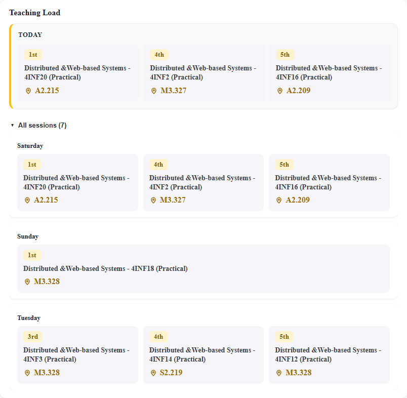
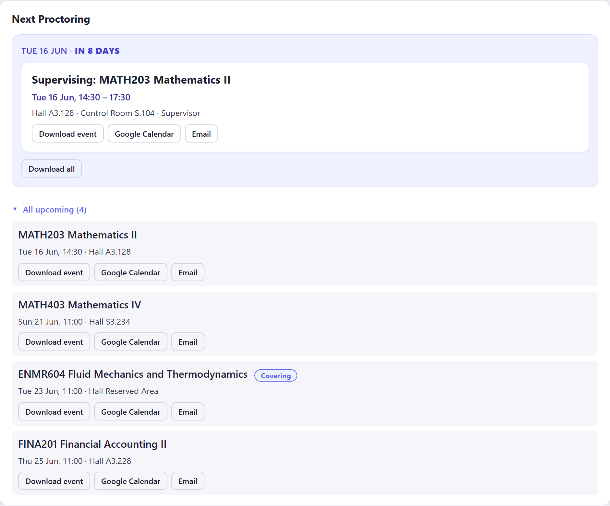
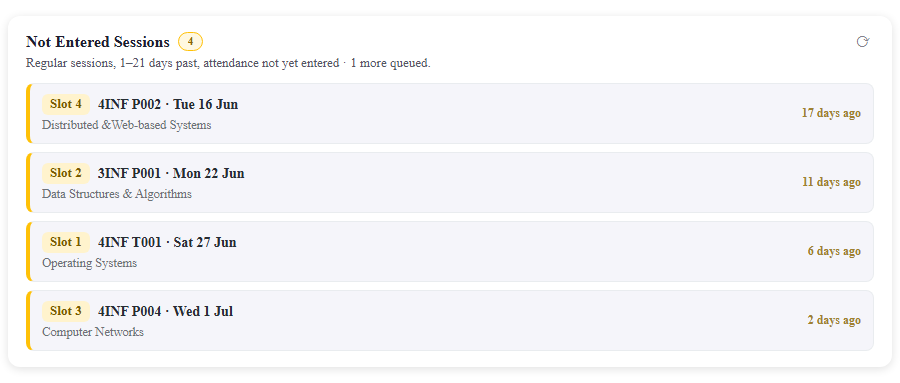
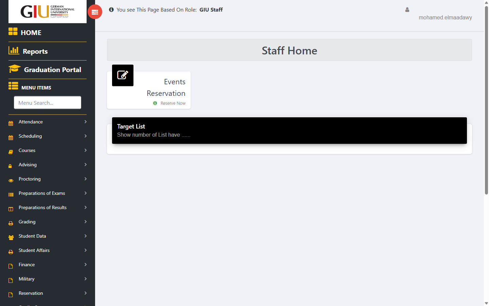
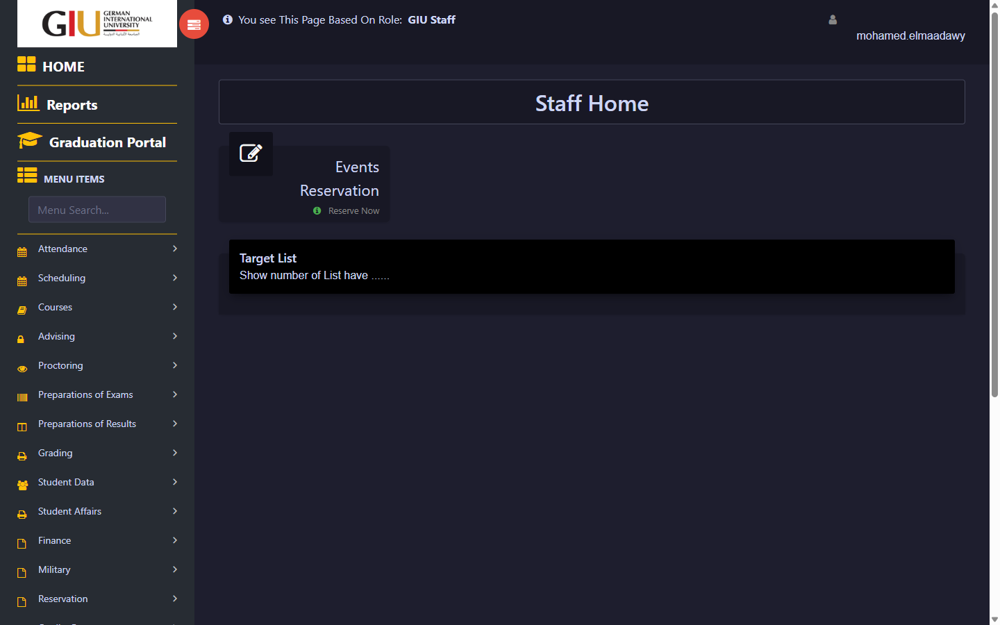

# GIU SuperScript

Browser add-ons (Tampermonkey userscripts) that add useful tools to the GIU staff portal: an attendance dashboard, teaching and proctoring widgets, batch grade upload, batch email and more. Everything appears inside the portal pages you already use.

Works on the **Cairo portal** ([portal.giu-uni.de](https://portal.giu-uni.de)) and the **Berlin portal** ([portal.giu-berlin.de](https://portal.giu-berlin.de)).

**Contents:** [Which script do I need?](#which-script-do-i-need) · [Install](#install) · [Features](#features) · [Berlin portal](#berlin-portal) · [Troubleshooting](#troubleshooting) · [Feedback](#feedback)

---

## Which script do I need?

| You work on… | Install | Optional |
| --- | --- | --- |
| **Cairo portal** | [GIU SuperScript](https://raw.githubusercontent.com/Mohamed-Elmaadawy/GIU-SuperScript/master/scripts/GIU%20SuperScript.user.js) — all Cairo features in one script | [GIU Theme](https://raw.githubusercontent.com/Mohamed-Elmaadawy/GIU-SuperScript/master/scripts/GIU%20Theme.user.js) — light/dark themes |
| **Berlin portal** | [GIU Berlin SuperScript](https://raw.githubusercontent.com/Mohamed-Elmaadawy/GIU-SuperScript/master/scripts/GIU%20Berlin%20SuperScript.user.js) — the Berlin features in one script | — |
| **Both** | Both SuperScripts — they run on different portals, so they don't clash | GIU Theme |

Each SuperScript has a **Control Center** card on the portal Home page where you can switch individual features on or off.

> **One rule:** per portal, install the SuperScript **or** the single-feature scripts below — never both. Both would add every widget twice.

<details>
<summary><b>Single-feature scripts</b> (only if you want just one feature)</summary>

| Script | Version | Portal | Install |
| --- | --- | --- | --- |
| Staff Enhanced Attendance | 3.2.12 | Cairo | [install](https://raw.githubusercontent.com/Mohamed-Elmaadawy/GIU-SuperScript/master/scripts/individual/GIU%20Staff%20Attendance%20Script.user.js) |
| Berlin Attendance | 1.0.5 | Berlin | [install](https://raw.githubusercontent.com/Mohamed-Elmaadawy/GIU-SuperScript/master/scripts/individual/GIU%20Berlin%20Attendance.user.js) |
| Teaching Load | 1.1.5 | Cairo | [install](https://raw.githubusercontent.com/Mohamed-Elmaadawy/GIU-SuperScript/master/scripts/individual/GIU%20Teaching%20Load.user.js) |
| Proctoring Reminder | 1.1.4 | Cairo | [install](https://raw.githubusercontent.com/Mohamed-Elmaadawy/GIU-SuperScript/master/scripts/individual/GIU%20Proctoring%20Reminder.user.js) |
| Not Entered Sessions | 1.1.2 | Cairo | [install](https://raw.githubusercontent.com/Mohamed-Elmaadawy/GIU-SuperScript/master/scripts/individual/GIU%20Not%20Entered%20Sessions.user.js) |
| Student Attendance Report | 1.3.1 | Cairo | [install](https://raw.githubusercontent.com/Mohamed-Elmaadawy/GIU-SuperScript/master/scripts/individual/GIU%20Student%20Attendance%20Report.user.js) |
| Upload Grades | 2.4.2 | Cairo | [install](https://raw.githubusercontent.com/Mohamed-Elmaadawy/GIU-SuperScript/master/scripts/individual/GIU%20Upload%20Grades.user.js) |
| Manage Group Grades | 1.5 | Cairo | [install](https://raw.githubusercontent.com/Mohamed-Elmaadawy/GIU-SuperScript/master/scripts/individual/GIU%20Manage%20Group%20Grades.user.js) |
| Notification Batch Send | 1.4.1 | Cairo | [install](https://raw.githubusercontent.com/Mohamed-Elmaadawy/GIU-SuperScript/master/scripts/individual/GIU%20Notification%20Batch%20Send.user.js) |
| Berlin Session Form Filler | 1.0.0 | Berlin (Microsoft Form) | [install](https://raw.githubusercontent.com/Mohamed-Elmaadawy/GIU-SuperScript/master/scripts/individual/GIU%20Berlin%20Session%20Form%20Filler.user.js) |

The bundles: GIU SuperScript **1.3.12**, GIU Berlin SuperScript **1.0.5**, GIU Theme **1.0.2**.

</details>

---

## Install

1. **Install Tampermonkey** for your browser: [Chrome / Edge / Brave](https://chromewebstore.google.com/detail/tampermonkey/dhdgffkkebhmkfjojejmpbldmpobfkfo) · [Firefox](https://addons.mozilla.org/en-US/firefox/addon/tampermonkey/) · [Safari](https://apps.apple.com/us/app/tampermonkey/id1482490089)
2. **Chrome / Edge only:** open the extensions page (`chrome://extensions` or `edge://extensions`), click **Details** on Tampermonkey and turn on **Allow User Scripts** (on older versions: turn on **Developer mode** at the top right). Without this, Tampermonkey can't run any script.
3. **Click the install link** for your script in the table above. Tampermonkey opens its install page — click **Install**.
4. **Open the portal** (or reload it). The new widgets appear on their pages; see [Features](#features) for where.

<details>
<summary>The install link only shows code / nothing happens?</summary>

Install it from Tampermonkey instead: Tampermonkey icon → **Dashboard** → **Utilities** tab → **Install from URL**, paste the script's address and click **Install**:

| Script | Address to paste |
| --- | --- |
| GIU SuperScript | `https://raw.githubusercontent.com/Mohamed-Elmaadawy/GIU-SuperScript/master/scripts/GIU%20SuperScript.user.js` |
| GIU Berlin SuperScript | `https://raw.githubusercontent.com/Mohamed-Elmaadawy/GIU-SuperScript/master/scripts/GIU%20Berlin%20SuperScript.user.js` |
| GIU Theme | `https://raw.githubusercontent.com/Mohamed-Elmaadawy/GIU-SuperScript/master/scripts/GIU%20Theme.user.js` |

Single-feature scripts: same address pattern with `scripts/individual/<file name>.user.js` (spaces written as `%20`).

</details>

**Updates are automatic.** Tampermonkey checks for new versions regularly. To check now: Tampermonkey **Dashboard → Utilities → Check for userscript updates**.

<details>
<summary>Don't want automatic updates?</summary>

Updates only ever come from this repository, but you can turn them off for any script:

1. Tampermonkey **Dashboard** → click the script's name to open the editor.
2. Delete these two lines near the top (in the `// ==UserScript==` block):

   ```text
   // @updateURL    https://raw.githubusercontent.com/Mohamed-Elmaadawy/GIU-SuperScript/master/...
   // @downloadURL  https://raw.githubusercontent.com/Mohamed-Elmaadawy/GIU-SuperScript/master/...
   ```

3. Press **Ctrl + S** to save.
4. Also open the script's **Settings** tab (next to **Editor**) and untick **Check for updates** — Tampermonkey otherwise remembers where the script was installed from.

To update later, install the script again from its link above.

</details>

<details>
<summary>Installed by copy-pasting the code?</summary>

A pasted copy doesn't auto-update. Reinstall it once from the install link above; after that, updates arrive automatically.

</details>

---

## Features

**Available in:** 🅒 GIU SuperScript (Cairo) · 🅑 GIU Berlin SuperScript (Berlin)

### Attendance — 🅒 🅑

**Staff Enhanced Attendance** turns the gate-attendance report into a dashboard:

- **Home widget** with this payroll month's worked vs required hours, balance, and absent days (one click to file an absent day as holiday, annual leave or compensation).
- **Full report** with both payroll months (11th → 10th), late arrivals, audit log, and progress bars.
- **Settings** for holidays and annual leave (ranges supported), leave balance with monthly accrual, attendance overrides (missions, missing punches), compensation days, Ramadan and exam periods.
- **Backup:** export/import all settings as a `.json` file.


**First-run setup.** The first time you open it, a short wizard sets everything up — no need to touch the settings:

1. Import a settings file from before (optional — skips the rest).
2. *(Berlin only)* The date you started at the Berlin branch.
3. Your weekly day off.
4. Whether your day off changed in the last 2 months (then: the previous day and the date it changed).
5. Remaining annual leave days.
6. Leave days earned per month (pre-filled).
7. Download a backup of your settings, then **Finish**.

You can **Skip** at any step; **Settings → Run setup again** reopens it any time. Your day off is never guessed — until it's set, the Home widget shows **Set your day off**.

Where it appears: Cairo — Home page and the [attendance report](https://portal.giu-uni.de/GIUb/EXT/SwiftReports_m.aspx?swiftreportid=866&executereport=1). Berlin — Home page and **My Attendance** in the sidebar (see [Berlin portal](#berlin-portal)).

### Teaching & exams

**Teaching Load** — 🅒 · Home page. Today's sessions at the top, the full week below, with course names (not codes), period slot and room.

**Proctoring Reminder** — 🅒 🅑 · Home page. Your next proctoring/supervising duty with countdown, hall and time; the remaining exams on expand; add any session (or all) to your calendar (`.ics`, Google Calendar) or email yourself a reminder.

**Proctor Schedule Aggregator** — 🅒 · Proctor Exchange page. All proctor assignments across departments in one searchable, filterable table; **Take** a colleague's duty directly (with the portal's confirmation step).

**Not Entered Sessions** — 🅒 · Home page. Lists Regular sessions 1–21 days old with no attendance entered yet; click one to open it on the attendance page, already selected. Hidden when there's nothing to enter.

**Berlin Session Form Filler** — 🅑 separate script · the Berlin session attendance Microsoft Form. Save your name once and a preset per course / session type / group; one click fills name, course, session type and group. You still enter the session date and Ref. ID, attach the attendance sheet and press Submit yourself.

**Student Attendance Report** — 🅒 · Manage Student Attendances page. For the selected group: absence level per student (Level 0 → 3 / drop), group averages, and an at-risk list you can expand to see the missed sessions.

| Teaching Load | Proctoring Reminder | Not Entered Sessions |
| --- | --- | --- |
|  |  |  |

### Grades

**Upload Grades** — 🅒 🅑 · Manage Uploaded Grades page. Download all groups' grades as one CSV, or upload one CSV to every group in one go; per-group statistics (min, max, average, pass rate). Single-group upload/download too.

```csv
Name,Group,Grade
(12345678) Ahmed Mohamed,INCS 406 - 4INF2 (Practical),85
```

Students are matched by the ID in brackets, so row order doesn't matter.


**Manage Group Grades** — 🅒 · Manage Group Grade page. CSV upload/download and statistics for the selected group, appearing once the grade table is shown.

### Communication

**Notification Batch Send** — 🅒 🅑 · Send Email page. Write one message and send it to several tutorial groups in sequence, with a course filter, progress banner and a sent/failed summary. Keep the tab open until it finishes.


### Appearance — separate script

**GIU Theme** · every Cairo portal page. A picker on the right edge switches between **Off**, **Light**, **Slate** (dark) and **Plum**. The portal and all SuperScript widgets follow the theme. Install it next to the SuperScript (it's separate on purpose — it must load before the page).

> Replaces the old "GIU Dark Mode" script: remove that one and install GIU Theme once.

| Light | Dark |
| --- | --- |
|  |  |

---

## Berlin portal

Staff of **GIU and GUC** in Berlin use the Berlin portal, but the attendance timesheet only exists on each university's **Cairo** portal. The Berlin scripts read it from Cairo for you.

- **Once per browser session, you need to be signed in to your Cairo portal** (GIU or GUC — your Cairo account may differ from your Berlin account). When you're not, the widget shows **Sign in to Cairo**: a small window opens with the browser's own login box, and closes itself when you're done. The script never asks for or stores your password.
- **First run:** choose **GIU** or **GUC**, then the setup wizard (above) runs, including your Berlin start date.
- **Full report:** sidebar **My Attendance**, or **View full report** in the widget. **Switch University** changes GIU/GUC later.
- The Berlin week always has **Sunday** off; days before your Berlin start date follow the Cairo week (Friday off).
- **Times are shown in Berlin time.** The Cairo portal records Berlin badge times on Cairo's clock; the script converts each day using that day's actual difference (usually 1 hour, 0 from late March to late April, 2 for a few days in late October). The timesheet's **Time diff** column shows the difference used (`—` = before your Berlin start date, not converted). Late arrivals and the 7:00 PM cap are checked on Berlin time; worked durations don't change.
- On Home, the **Session** and **NoUserName** cards are hidden while their count is 0.
- Tested on Chrome. Settings on Berlin are separate from those on Cairo.

---

## Troubleshooting

| Problem | Fix |
| --- | --- |
| A widget appears twice | You have the SuperScript **and** a single-feature script for the same portal. Remove one. |
| Nothing appears | Check the script is enabled in Tampermonkey, then reload the page. Make sure you're on the page listed under [Features](#features). |
| Berlin: "Not signed in to … Cairo" | Click **Sign in to Cairo**, sign in, and the widget reloads. |
| Berlin: the sign-in window doesn't open | Allow pop-ups for `portal.giu-berlin.de`. Until then the button opens Cairo in a new tab — sign in there, then press **Retry**. |
| Attendance numbers are grey | Your day off isn't set yet — click **Set your day off**. |
| Moving to a new computer/browser | In attendance **Settings**, export your settings (`.json`); on the new browser, import it in the first-run wizard. |
| Want a feature off | Use the **Control Center** card on the portal Home page. |

**Requirements:** Tampermonkey 4.x or later; Chrome, Edge, Brave or Firefox (the Berlin scripts are tested on Chrome); an active portal login.

---

## Feedback

Suggestions, bugs or feature requests: [mohamed.elmaadawy@giu-uni.de](mailto:mohamed.elmaadawy@giu-uni.de)

Authors: Mo.Elmaadawy · Upload Grades with Ahmed Sherif.
